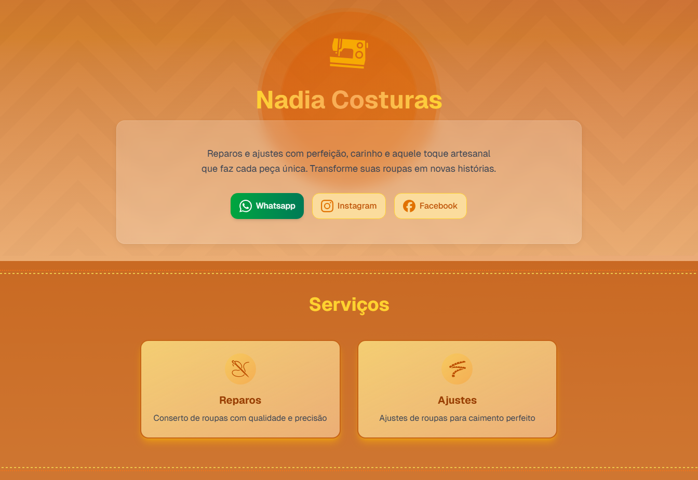

# Nadia Costuras ✂️

A clean and modern microsite for Nadia, a talented seamstress who specializes in custom tailoring and clothing repairs. Built with cutting-edge frontend tech to reflect her warm, welcoming style and love for home and animals.

## 🔗 Live Preview

[View Live Site](https://nadiacosturas.vercel.app/)



---

## ✨ Features

- Responsive layout for mobile and desktop
- Soft, warm theme using orange/yellow tones
- ShadCN UI with minimal design system
- Framer Motion animations
- Accessible and performant setup

---

## 🛠️ Tech Stack

- [Bun](https://bun.sh/) `v1.2.19`
- [Next.js](https://nextjs.org/) `v15`
- [TypeScript](https://www.typescriptlang.org/) `v5.8.3`
- [Tailwind CSS](https://tailwindcss.com/) `v4.1`
- [iconify](https://iconify.design/) `v0.526.0`
- [Motion](https://motion.dev/) `12.23.9`
- [Sharp](https://sharp.pixelplumbing.com/) `v0.34.3`

---

## 🚀 Getting Started

1. **Clone the repo**

```bash
git clone https://github.com/marcythany/nadiacosturas.git
cd nadiacosturas
```

2. **Install dependencies**

```bash
bun install
```

3. **Run dev server**

```bash
bun run dev
```

---

## 📦 Project Structure

```
/ - Next.js project root
nadia-costuras/
├─ .husky/
│  └─ _/
│     ├─ .gitignore
│     ├─ applypatch-msg
│     ├─ commit-msg
│     ├─ h
│     ├─ husky.sh
│     ├─ post-applypatch
│     ├─ post-checkout
│     ├─ post-commit
│     ├─ post-merge
│     ├─ post-rewrite
│     ├─ pre-applypatch
│     ├─ pre-auto-gc
│     ├─ pre-commit
│     ├─ pre-merge-commit
│     ├─ pre-push
│     ├─ pre-rebase
│     └─ prepare-commit-msg
├─ .vercel/
│  ├─ project.json
│  └─ README.txt
├─ public/
│  ├─ pattern.svg
│  ├─ screenshot.png
│  └─ zig-zag.svg
├─ src/
│  ├─ app/
│  │  ├─ favicon.ico
│  │  ├─ globals.css
│  │  ├─ layout.tsx
│  │  ├─ page.tsx
│  │  ├─ robots.ts
│  │  └─ sitemap.ts
│  ├─ components/
│  │  ├─ ui/
│  │  │  └─ Icon.tsx
│  │  ├─ AnimatedHero.tsx
│  │  ├─ AnimatedService.tsx
│  │  ├─ FloatingActionButton.tsx
│  │  ├─ MotionWrapper.tsx
│  │  ├─ ServiceCard.tsx
│  │  └─ structured-data.tsx
│  ├─ lib/
│  │  ├─ conts.ts
│  │  └─ utils.ts
│  └─ types/
│     └─ index.ts
├─ .gitignore
├─ .lighthouserc.js
├─ commitlint.config.js
├─ components.json
├─ eslint.config.mjs
├─ LICENSE
├─ next-env.d.ts
├─ next.config.ts
├─ package.json
├─ postcss.config.mjs
├─ README.md
├─ tsconfig.json
└─ vercel.json
```

---

## 💬 License

This project is for personal and learning purposes only.

---

Made with ❤️ by [Marcy](https://github.com/marcythany)

